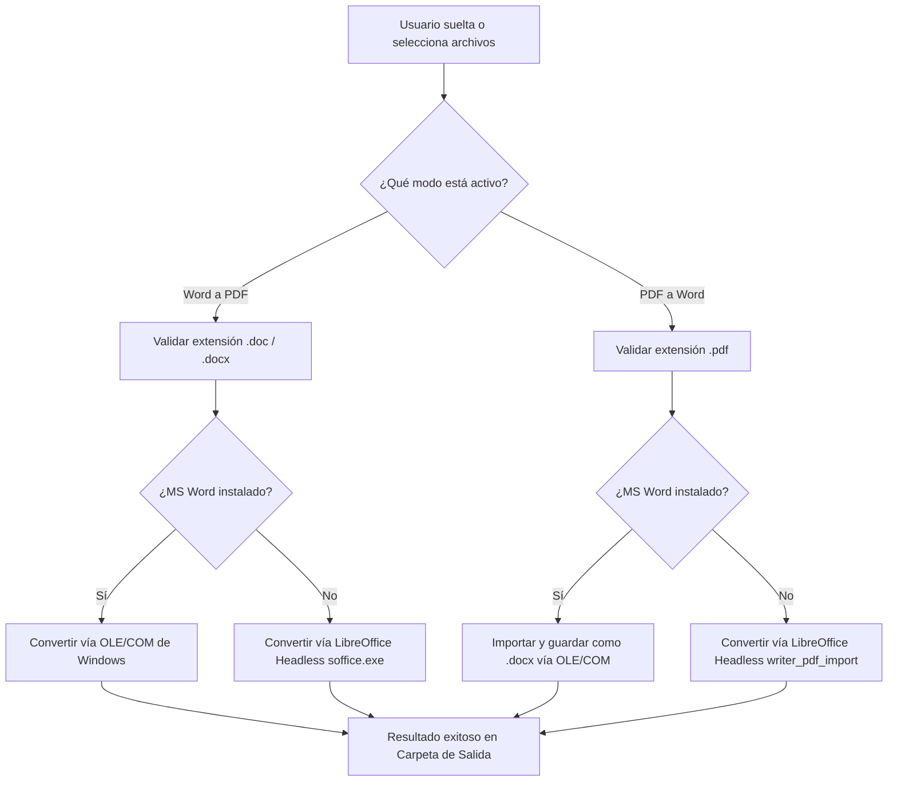

# 📄 Conversor Inteligente (Word to PDF Desktop Converter)

<p align="center">
  
  
  
  
</p>

Una aplicación de escritorio de alto rendimiento para **Windows** que permite convertir documentos de manera bidireccional: **Word a PDF** y **PDF a Word (.docx)** de forma totalmente local, rápida y segura. 

Diseñada con una experiencia de usuario moderna y limpia, con soporte para procesamiento por lotes (multi-archivo) y arrastrar y soltar (Drag & Drop).

---

## 🚀 Características Principales

*   **Conversión Bidireccional Inteligente:**
    *   **Word a PDF:** Convierte archivos `.doc` y `.docx` a `.pdf`.
    *   **PDF a Word:** Convierte archivos `.pdf` a formato editable `.docx`.
*   **Procesamiento por Lotes (Multi-archivo):** Arrastra o selecciona múltiples archivos a la vez para procesarlos en cola secuencialmente.
*   **Estrategia "Word-First" (Doble Nivel):**
    *   **Prioridad 1 (MS Word OLE/COM):** Si Microsoft Word está instalado en el sistema, la app lo automatiza en segundo plano para una conversión perfecta con 100% de fidelidad de formato.
    *   **Prioridad 2 (LibreOffice Fallback):** Si MS Word no está disponible, se utiliza automáticamente LibreOffice en modo *headless* (`soffice.exe`) de manera local y transparente para el usuario.
*   **Drag & Drop Nativo (Arrastrar y Soltar):** Permite soltar archivos directamente sobre la ventana de la aplicación.
*   **Selector Manual como Respaldo:** Botón dedicado para abrir el explorador de archivos nativo de Windows.
*   **Selección de Carpeta de Salida:** Posibilidad de guardar los archivos en una carpeta de destino personalizada o guardarlos en la carpeta origen por defecto.
*   **Interfaz Ultra Moderna:** Interfaz interactiva y limpia con modo oscuro incorporado, indicadores visuales de progreso (spinners) y estados de conversión detallados por cada archivo.

---

## 🛠️ Arquitectura de Conversión

La aplicación utiliza un flujo inteligente para determinar la mejor herramienta disponible en el sistema del usuario con el fin de garantizar la mayor precisión posible en el formato resultante.



---

## 📋 Requisitos del Sistema

Para el correcto funcionamiento de la aplicación en Windows, se requiere contar con alguno de los siguientes motores locales de conversión:

1.  **Opción A (Recomendado):** Tener instalado **Microsoft Word** en el sistema (automatización COM nativa).
2.  **Opción B (Alternativa):** Tener instalado **LibreOffice**.
    *   La app busca automáticamente el ejecutable `soffice.exe` en las rutas por defecto:
        *   `C:\Program Files\LibreOffice\program\soffice.exe`
        *   `C:\Program Files (x86)\LibreOffice\program\soffice.exe`
    *   *Opcional:* Puedes definir la variable de entorno de sistema `LIBREOFFICE_PATH` con la ruta completa a tu ejecutable `soffice.exe`.

---

## 💻 Requisitos de Desarrollo

Si deseas compilar la aplicación por tu cuenta, necesitarás instalar:

*   **Go** (versión 1.21 o superior)
*   **Wails CLI** (v2.x) - [Guía de Instalación](https://wails.io/docs/gettingstarted/installation)
*   **Node.js & npm** (para la interfaz de usuario frontend)
*   Un compilador de C en Windows (como **w64devkit** o **MSYS2 / MinGW-w64** para habilitar CGO).

---

## ⚙️ Cómo Ejecutar en Desarrollo

1.  Clona el repositorio y navega a la carpeta del proyecto:
    ```bash
    cd word-to-pdf-desktop-go
    ```
2.  Instala las dependencias de NodeJS e inicia el servidor de desarrollo de Wails:
    ```bash
    wails dev
    ```
    *Este comando compilará el backend en Go, descargará las dependencias de Javascript, levantará un servidor de desarrollo hot-reload en el puerto `5173` y abrirá la ventana nativa de la aplicación.*

---

## 📦 Compilación para Producción

Para generar el ejecutable de Windows standalone (un único archivo `.exe` optimizado, sin consola de comandos de fondo):

1.  Ejecuta el siguiente comando en la raíz del proyecto:
    ```bash
    wails build
    ```
2.  Una vez completado, el instalador o ejecutable final se encontrará en la ruta:
    ```text
    word-to-pdf-desktop-go/build/bin/word-to-pdf-desktop-go.exe
    ```

---

## 📂 Estructura del Código

La solución está estructurada siguiendo la arquitectura limpia y modular exigida por Wails:

*   `main.go`: Inicializa y configura la ventana principal de Wails, activa la funcionalidad nativa de arrastre de archivos `DragAndDrop` y enlaza el backend en Go con el frontend.
*   `app.go`: Define la estructura `App` y expone los métodos que serán llamados desde JavaScript (`SelectFiles`, `SelectPDFFiles`, `SelectOutputFolder`, `ConvertToPDF`, `ConvertToWord`, `OpenFolder`).
*   `converter.go`: **El núcleo del sistema.** Contiene la lógica detallada para interactuar con la API OLE/COM de Windows y la lógica fallback para ejecutar comandos headless de LibreOffice.
*   `frontend/`: Contiene la interfaz de usuario.
    *   `index.html`: Estructura HTML5 semántica y accesible.
    *   `src/style.css`: Estilo visual premium con degradados suaves, transiciones, diseño responsivo y compatibilidad con modos oscuros.
    *   `src/main.js`: Lógica del lado del cliente que interactúa con las APIs exportadas de Go, administra los eventos de arrastre nativos y renderiza la lista de archivos dinámicamente.

---

## ⚠️ Solución de Problemas (Troubleshooting)

### El Arrastre y Soltado (Drag & Drop) no responde
> [!WARNING]
> **Aislamiento de Privilegios de Interfaz de Usuario (UIPI) en Windows:**
> Si estás ejecutando tu terminal (CMD, PowerShell o VS Code) o la aplicación final **como Administrador**, Windows bloqueará los eventos de arrastre provenientes de aplicaciones con privilegios normales (como el Explorador de Archivos de Windows).
>
> **Solución:** Ejecuta la terminal y la aplicación sin privilegios de administrador. Si persiste, reinicia el proceso `explorer.exe` desde el Administrador de Tareas.

### Error "Microsoft Word no parece estar instalado o accesible"
> [!NOTE]
> Este error ocurre si la aplicación no puede iniciar la comunicación OLE. No te preocupes: si tienes LibreOffice instalado en tu sistema, la aplicación utilizará automáticamente el fallback local sin interrumpir tu trabajo.

### Permiso denegado al guardar archivos
> [!IMPORTANT]
> Asegúrate de que la carpeta de destino seleccionada no requiera privilegios especiales de escritura (como la raíz del disco `C:\` o carpetas protegidas del sistema de Windows) o que el archivo PDF/Word de salida no esté abierto en otra aplicación (como Acrobat Reader o Microsoft Word), lo cual bloquea su sobreescritura.

---

## 📄 Licencia

Este proyecto está disponible bajo los términos de uso locales definidos para el desarrollo. LibreOffice y Microsoft Word son marcas registradas de sus respectivos propietarios.
